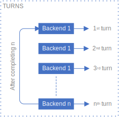

# Simple Load Balancer Server

Load Balancer create by GoLang.

Use Round Robin algorithm to set Backend selected and send requests into this. Support retries and attempts connect Backend.

# Round Robin Selection

Round Robin is simple terms. It give equal opportunities for workers to perform task in turns.

Some time, We have backend not running(down, dead). We probably don't want to route traffic there. We need to route traffic only to backends which are up and running.
